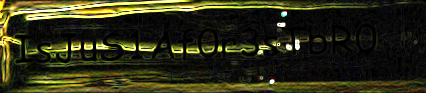

# Forest

> **Explore the forest and capture the flag!**

## Fast and failed

```
exiftoof forest.jpg
strings -n8 forest.jpg
```

Results are generic / random.

## Inspecting the image

Here's an idea: let's render the image :O

There's some black text over the trees' shadows, in the upper left corner.

Gimp saves the day with its image filters:
- cut the suspicious area
- rotate 90 degrees
- apply edge detection filter

The texts is now readable:


> IsJuS1Af0r3sTbR0

HTB doesn't accept this as a flag yet...

## Extracting hidden data

So the first piece of text must unlock further data, like a password.
Using common tools for hidding data in images:

```
steghide extract -sf forest.jpg
Enter passphrase:
wrote extracted data to "nothinghere.txt".
```

## Interpreting the hidden data

At first glance "nothinghere.txt" contains random text.

```
Gur sberfg vf n pbzcyrk rpbflfgrz pbafvfgvat znvayl bs gerrf gung ohssre gur rnegu naq fhccbeg n zlevnq bs yvsr sbezf. Gur gerrf uryc perngr n fcrpvny raivebazrag juvpu, va ghea, nssrpgf gur xvaqf bs navznyf naq cynagf gung pna rkvfg va gur sberfg. Gerrf ner na vzcbegnag pbzcbarag bs gur raivebazrag. Gurl pyrna gur nve, pbby vg ba ubg qnlf, pbafreir urng ng avtug, naq npg nf rkpryyrag fbhaq nofbeoref. UGO{NzNm1aTfXvyYmMOe0}
```

But there's actually structure to it:
- chunks of letters separated by spaces
- the length of the chunks is
- there's `.,` syntax

All the characteristics of a common phrase, except the letters aren't coherent.
This piece of text is especially flashy:

> `UGO{NzNm1aTfXvyYmMOe0}`

Most likely a rotation of the letters.

And bingo rot13 finally spits the flag!
